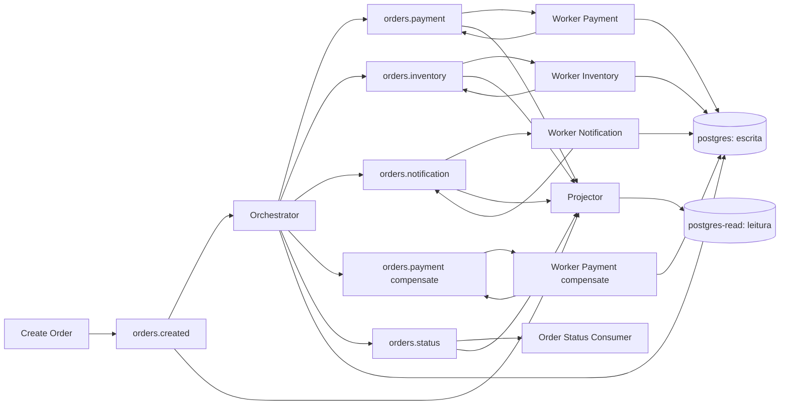
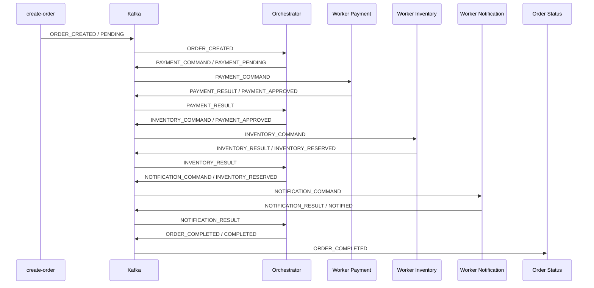

# Order Saga Microservices

[](https://github.com/alppinheiro/workers-kafka/actions/workflows/ci.yml)

Projeto de estudo em Go para simular o ciclo de vida de um pedido com saga orquestrada e workers assíncronos via Kafka.

O fluxo é centrado em um orquestrador que recebe a criação do pedido, publica comandos para os workers e decide o próximo passo a partir dos resultados de pagamento, estoque e notificação.

Este repositório foi desenhado para ser pequeno o suficiente para estudar rapidamente e rico o suficiente para demonstrar os principais pontos de uma arquitetura distribuída orientada a eventos: coordenação central da saga, separação de responsabilidades, retries, falhas definitivas, rastreabilidade ponta a ponta e depuração reproduzível.

## Resumo Rápido

Arquitetura implementada neste projeto:

- saga orquestrada com orquestrador central
- workers independentes para pagamento, estoque e notificação
- compensação assíncrona de pagamento quando o estoque falha após aprovação
- Kafka como barramento entre comandos, resultados e eventos finais
- persistência do estado da saga em PostgreSQL (recuperação pós-restart)
- journal de eventos com payloads de request/response dos gateways (rastreabilidade)
- banco de leitura (read model) alimentado por projeção via Kafka (serviço `projector`)
- execução local com Docker Compose
- debug ponta a ponta com VS Code e logs correlacionados

Leituras mais úteis neste README:

- [Quick Start](#quick-start)
- [Visão Geral da Arquitetura](#visão-geral-da-arquitetura)
- [Casos Possíveis na Aplicação](#casos-possíveis-na-aplicação)
- [Cenários Determinísticos para Debug](#cenários-determinísticos-para-debug)
- [Debug Ponta a Ponta no VS Code](#debug-ponta-a-ponta-no-vs-code)

## Destaques

- saga orquestrada com fluxo explícito de sucesso, retry e falha
- workers isolados por etapa: pagamento, estoque e notificação
- estorno de pagamento assíncrono com `transaction_id` para compensação
- Kafka como barramento de eventos entre os processos
- eventos terminais publicados separadamente para auditoria
- estado da saga persistido em PostgreSQL (banco de escrita) com recuperação após restart
- todos os eventos gravados em `saga_events` (journal) com payloads de request/response
- read model `order_views` no banco de leitura, projetado via Kafka pelo `projector`
- outbox pattern: eventos decididos são registrados na outbox e publicados pelo `outbox-relay`
- DLQ: mensagens com erro definitivo vão para tópicos `orders.*.dlq`
- idempotência por `event_id` no orquestrador e nos workers
- cenários determinísticos por `order_id` para reproduzir falhas e retries
- debug ponta a ponta com VS Code, Docker e logs correlacionados

## Quando Este Projeto é Útil

Este projeto é útil para quem quer:

- estudar saga orquestrada em Go sem depender de uma base muito grande
- entender como separar orquestração, domínio, infraestrutura e workers
- experimentar cenários de falha em pipelines assíncronos
- praticar debug distribuído com Kafka, logs e múltiplos processos
- usar um projeto base para evoluir depois com DLQ, observabilidade e concorrência
- aprender CQRS na prática com projeção de eventos via Kafka

## Objetivo

Este repositório demonstra:

- arquitetura de saga orquestrada em Go
- workers separados por responsabilidade
- integração assíncrona via Kafka
- fluxo completo de sucesso, retry e falha definitiva
- depuração ponta a ponta com VS Code, Docker e logs correlacionados

## Quick Start

```bash
cp .env.example .env   # (opcional) configuração por ambiente — veja abaixo
make up
make create-order ORDER_ID=order-001
make logs
```

### Configuração por ambiente (12-factor)

Toda configuração vem de **variáveis de ambiente** (o código não tem `if ambiente`):

- **`docker-compose`** usa a rede interna do compose (`kafka:9092`, `postgres:5432`) e lê
  do `.env` apenas credenciais, portas mapeadas e tuning (`POSTGRES_*`, `*PORT`,
  `SAGA_WORKERS`, `KAFKA_AUTO_CREATE_TOPICS_ENABLE`, ...).
- **`go run` no host** (load-generator, testes, benchmark) usa as portas mapeadas no host
  (`localhost:9094`, `localhost:5433`) — faça `source .env` antes.
- **Produção (Kubernetes)** usará `ConfigMap`/`Secret` via Helm (próximas fases) — o mesmo
  binário, sem recompilação.

O `.env.example` documenta todas as variáveis; o `.env` real é ignorado pelo git
(nunca versionar credenciais).

Para validar o projeto localmente:

```bash
make check
```

Para reproduzir cenários de debug:

```bash
make create-order ORDER_ID=order-payment-fail-001
make create-order ORDER_ID=order-inventory-retry-once-001
make create-order ORDER_ID=order-notification-fail-001

make create-order ORDER_ID=order-inventory-fail-001  # aciona compensação do pagamento quando aplicável
```

Para consultar a linha do tempo de um pedido no read model (banco de leitura):

```bash
make inspect ORDER_ID=order-001
```

Para consultar o journal completo de eventos com payloads (banco de escrita):

```bash
docker-compose exec postgres psql -U saga -d saga -c "SELECT id, component, direction, event_type, status_anterior, status_atual, payload, request_payload, response_payload FROM saga_events WHERE order_id='order-001' ORDER BY id;"
```

### Passo a passo

#### 1. Suba a stack local

```bash
make up
```

#### 2. Dispare um pedido de sucesso

```bash
make create-order ORDER_ID=order-001
```

#### 3. Dispare cenários controlados de debug

```bash
make create-order ORDER_ID=order-payment-fail-001
make create-order ORDER_ID=order-inventory-retry-once-001
make create-order ORDER_ID=order-notification-fail-001
```

#### 4. Acompanhe os logs

```bash
make logs
```

#### 5. Valide o projeto

```bash
make check
```

### Testes de integração (Testcontainers)

Testes com **Kafka e Postgres reais em containers** (independentes do `docker-compose`),
protegidos pela build tag `integration`:

```bash
make integration
```

Cobertura:
- **Round-trip Kafka**: `Producer` publica e `Consumer` recebe o evento (Kafka real em container).
- **Fluxo completo da saga**: orquestrador + repositórios reais contra Postgres real em container
  (journal `saga_events` com a sequência IN/OUT completa até `COMPLETED`).

No macOS com Colima, o `make integration` já aponta o socket do Docker para a VM do Colima.
No Linux (CI/GitHub Actions) as variáveis `DOCKER_HOST`/`TESTCONTAINERS_DOCKER_SOCKET_OVERRIDE`
definidas localmente são respeitadas.

## Visão Geral da Arquitetura



- **Banco de escrita** (`postgres`, :5433): orquestrador e workers persistem o estado da saga (`sagas`), o journal de todos os eventos com payloads de request/response dos gateways (`saga_events`) e os eventos a publicar (`outbox`).
- **Banco de leitura** (`postgres-read`, :5434): o serviço **`projector`** consome os cinco tópicos do Kafka e monta o read model (`order_views`) + dedup (`processed_events`), pronto para uma futura API de consulta.
- **Garantia de dados**: at-least-once + dedup por `event_id` + reentrega do Kafka; o orquestrador pode ser reiniciado no meio de uma saga e ela continua de onde parou.
- **Publicação**: orquestrador e workers escrevem eventos na **outbox** (banco de escrita); o serviço **`outbox-relay`** publica de fato no Kafka e marca `published_at`. Erros definitivos vão para tópicos DLQ (`orders.*.dlq`).

## Fluxo Ponta a Ponta

### Fluxo Feliz



> **Persistência:** cada evento desse fluxo é gravado no journal (`saga_events`) do banco de escrita e projetado no read model (`order_views`) do banco de leitura pelo serviço `projector`.

### Fluxo com falha no estoque (compensação)

```mermaid
sequenceDiagram
    participant C as create-order
    participant K as Kafka
    participant O as Orchestrator
    participant P as Worker Payment
    participant I as Worker Inventory
    participant PC as Worker Payment (compensate)
    participant S as Order Status

    C->>K: ORDER_CREATED / PENDING
    K->>O: ORDER_CREATED
    O->>K: PAYMENT_COMMAND / PAYMENT_PENDING
    K->>P: PAYMENT_COMMAND
    P->>K: PAYMENT_RESULT / PAYMENT_APPROVED (tx=transaction_id)
    K->>O: PAYMENT_RESULT
    O->>K: INVENTORY_COMMAND / PAYMENT_APPROVED
    K->>I: INVENTORY_COMMAND
    I->>K: INVENTORY_RESULT / FAILED
    K->>O: INVENTORY_RESULT
    O->>K: PAYMENT_COMPENSATE / (transaction_id)
    K->>PC: PAYMENT_COMPENSATE
    PC->>K: PAYMENT_COMPENSATE_RESULT / PAYMENT_REFUNDED
    K->>O: PAYMENT_COMPENSATE_RESULT
    O->>K: ORDER_FAILED / FAILED + payment_refunded=true
    K->>S: ORDER_FAILED
  ```

### Fluxo de Decisão da Saga

```mermaid
flowchart TD
    A[ORDER_CREATED] --> B[PAYMENT_COMMAND]
    B --> C{PAYMENT_RESULT}
    C -->|PAYMENT_APPROVED| D[INVENTORY_COMMAND]
    C -->|RETRYING| B
    C -->|FAILED| Z1[ORDER_FAILED]

    D --> E{INVENTORY_RESULT}
    E -->|INVENTORY_RESERVED| F[NOTIFICATION_COMMAND]
    E -->|RETRYING| D
    E -->|FAILED| H[PAYMENT_COMPENSATE]

    H --> I{PAYMENT_COMPENSATE_RESULT}
    I -->|PAYMENT_REFUNDED| Z3[ORDER_FAILED refund ok]
    I -->|RETRYING| H
    I -->|FAILED| Z4[ORDER_FAILED refund failed]

    F --> G{NOTIFICATION_RESULT}
    G -->|NOTIFIED| Z2[ORDER_COMPLETED]
    G -->|RETRYING| F
    G -->|FAILED| Z5[ORDER_COMPLETED notification error]
```

## Status do Pedido

- `PENDING`: pedido criado
- `PAYMENT_PENDING`: aguardando processamento de pagamento
- `PAYMENT_APPROVED`: pagamento aprovado
- `PAYMENT_REFUND_PENDING`: estorno em andamento antes do encerramento da saga
- `PAYMENT_REFUNDED`: pagamento estornado/compensado
- `INVENTORY_RESERVED`: estoque reservado
- `NOTIFIED`: notificação concluída
- `COMPLETED`: saga concluída com sucesso
- `RETRYING`: falha temporária com nova tentativa coordenada pelo orquestrador
- `FAILED`: falha definitiva ou limite de retry excedido

## Tipos de Evento

- `ORDER_CREATED`
- `PAYMENT_COMMAND`
- `PAYMENT_RESULT`
- `PAYMENT_COMPENSATE`
- `PAYMENT_COMPENSATE_RESULT`
- `INVENTORY_COMMAND`
- `INVENTORY_RESULT`
- `NOTIFICATION_COMMAND`
- `NOTIFICATION_RESULT`
- `ORDER_COMPLETED`
- `ORDER_FAILED`

## Tópicos Kafka

- `orders.created`: evento inicial do pedido
- `orders.payment`: comandos e resultados de pagamento
- `orders.inventory`: comandos e resultados de estoque
- `orders.notification`: comandos e resultados de notificação
- `orders.status`: eventos terminais da saga

Todos os eventos usam `order_id` como chave de particionamento para preservar a ordem lógica do pedido.

## Estrutura do Projeto

```text
cmd/
  create-order/           publica o evento inicial do pedido
  orchestrator/           coordena a saga (estado persistido em PostgreSQL)
  projector/              projeta os eventos do Kafka no read model (banco de leitura)
  outbox-relay/           publica eventos da outbox no Kafka (lote + claims)
  autoscaler/             escala réplicas pelo lag do consumer group (análogo ao KEDA)
  load-generator/         publica pedidos em lote para testes de carga
  order-status/           consome eventos finais para auditoria
  worker-inventory/       processa estoque
  worker-notification/    processa notificação
  worker-payment/         processa pagamento (e compensação/estorno)

internal/
  application/
    orchestrator/         casos de uso e orquestração (estado + journal)
    worker/               workers por etapa (logam request/response dos gateways)
    projector/            projeção dos eventos no read model
  domain/                 entidades, eventos, saga e status
  infrastructure/
    external/             simuladores das APIs externas
    kafka/                producer, consumer, tópicos, DLQ e configuração
    outbox/               OutboxPublisher (EventPublisher para a tabela outbox)
    telemetry/            OpenTelemetry (OTLP + propagação W3C traceparent)
    persistence/
      postgres/           banco de escrita: SagaRepository, EventLogRepository, OutboxRepository
      postgres_read/      banco de leitura: OrderViewRepository (read model)
  interfaces/             adapters e logging

migrations/               SQL do banco de escrita (golang-migrate)
migrations-read/          SQL do banco de leitura (golang-migrate)
PHASE_*_PLAN.md           planos por fase (2–5) e BENCHMARK.md
.vscode/                  debug ponta a ponta no VS Code
docker-compose.yml        stack local com Kafka + Postgres (escrita/leitura) + Jaeger
Dockerfile                build parametrizado dos binários Go
Makefile                  atalhos de execução e validação
```

## Tecnologias Utilizadas

- Go 1.26.6
- Kafka
- `github.com/segmentio/kafka-go`
- PostgreSQL 16 (escrita e leitura)
- `github.com/jackc/pgx/v5` (driver PostgreSQL)
- `golang-migrate/migrate` (migrations via Docker)
- Docker
- Docker Compose
- VS Code Debug
- `gofmt`
- `go vet`
- `golangci-lint`

## Requisitos

- Go 1.26.6
- Docker
- Docker Compose
- VS Code com extensão Go, se quiser usar o fluxo de debug composto

## Como Executar Localmente

### Via Makefile

`make up` sobe a stack em background e devolve o terminal. Para acompanhar a execução, use `make logs`.

```bash
make up
```

### Criar um pedido manualmente

```bash
make create-order ORDER_ID=order-001
```

### Ver logs

```bash
make logs
```

### Derrubar a stack

```bash
make down
```

### Validar o projeto

```bash
make check
```

### Principais atalhos disponíveis

```bash
make help
make up
make logs
make create-order ORDER_ID=order-001
make check
make down
```

## Debug Ponta a Ponta no VS Code

O workspace já contém configuração para depurar a saga inteira localmente.

### Sessões disponíveis

- `Debug Saga End-to-End`
- `Debug Orchestrator`
- `Debug Worker Payment`
- `Debug Worker Inventory`
- `Debug Worker Notification`
- `Debug Projector`
- `Debug Order Status`
- `Create Order Event`

### Como usar

1. Inicie `Debug Saga End-to-End`.
2. O VS Code sobe `kafka`, `kafka-init`, `postgres`, `migrations`, `postgres-read` e `migrations-read` antes de iniciar os processos Go.
3. Rode `Create Order Event` e informe um `order_id`.
4. Acompanhe breakpoints e logs correlacionados nos processos locais.

Nesse modo, o Kafka e o Postgres rodam em containers e os processos Go rodam localmente com `KAFKA_BROKERS=localhost:9094` e `DATABASE_URL` apontando para `localhost:5433` (escrita) ou `localhost:5434` (leitura, no `Debug Projector`).

## Logs e Correlação

O projeto foi instrumentado para permitir rastreamento ponta a ponta.

### Logs de consumo

Os consumers registram:

- `component`
- `phase`
- `event_id`
- `order_id`
- `saga_id`
- `transaction_id`
- `type`
- `status_previous`
- `status_current`
- `schema_version`
- `metadata`
- `duration`

### Logs de publicação

O producer registra:

- `phase=publishing`
- `phase=published`
- `phase=failed`
- `topic`
- `payload_bytes`
- `transaction_id` quando presente
- todos os campos de correlação do evento

### Logs de decisão do orquestrador

O orquestrador registra ações como:

- `action=start`
- `action=handle-created`
- `action=dispatch-next`
- `action=advance`
- `action=retry-requested`
- `action=retrying`
- `action=retry-limit-exceeded`
- `action=fail-requested`
- `action=failed`
- `action=publishing-completed`
- `action=completed`

## Casos Possíveis na Aplicação

| Caso | O que acontece | Resultado final |
| --- | --- | --- |
| Sucesso completo | pagamento, estoque e notificação concluem com sucesso | `ORDER_COMPLETED` / `COMPLETED` |
| Falha definitiva no pagamento | pagamento retorna `FAILED` | `ORDER_FAILED` / `FAILED` |
| Falha definitiva no estoque (após pagamento aprovado) | estoque retorna `FAILED`; orquestrador solicita `PAYMENT_COMPENSATE` assíncrono com `transaction_id` e só finaliza após `PAYMENT_COMPENSATE_RESULT` | `ORDER_FAILED` / `FAILED` com metadata de estorno |
| Falha definitiva na notificação | notificação retorna `FAILED` (não houve erro em etapas anteriores) | `ORDER_COMPLETED` / `COMPLETED` + metadata `notification_error=true` |
| Falha temporária com recuperação | uma etapa retorna `RETRYING` e depois conclui | saga continua até sucesso ou nova decisão |
| Falha temporária até estourar retry em pagamento ou estoque | a etapa continua falhando temporariamente | `ORDER_FAILED` / `FAILED` |
| Falha temporária até estourar retry em notificação | a notificação continua falhando temporariamente | `ORDER_COMPLETED` / `COMPLETED` + metadata `notification_error=true` |
| Evento fora de ordem | resultado chega incompatível com o estado atual | evento rejeitado e saga não avança |

> Observação: quando aplicável, o orquestrador solicita um estorno assíncrono (`PAYMENT_COMPENSATE`) usando o `transaction_id` retornado no `PAYMENT_RESULT`. A saga só é encerrada depois do `PAYMENT_COMPENSATE_RESULT`, permitindo que o evento terminal carregue o resultado do estorno para auditoria e comunicação ao usuário.

### 1. Pedido completado com sucesso

Condição:

- pagamento aprovado
- estoque reservado
- notificação enviada

Resultado final:

- evento terminal `ORDER_COMPLETED`
- status final `COMPLETED`

### 2. Falha definitiva no pagamento

Condição:

- o worker de pagamento retorna `FAILED`

Resultado final:

- saga encerrada imediatamente
- evento terminal `ORDER_FAILED`
- status final `FAILED`

### 3. Falha definitiva no estoque

Condição:

- pagamento aprovado
- estoque retorna `FAILED`

Resultado final:

- saga encerrada com falha para o pedido
- evento terminal `ORDER_FAILED` emitido apenas após o resultado do estorno
- status final `FAILED`
- comando assíncrono `PAYMENT_COMPENSATE` publicado com `transaction_id`
- estorno processado pelo `worker-payment` antes do encerramento
- metadata terminal indicando `payment_refunded=true` ou `payment_refund_failed=true`

### 4. Falha definitiva na notificação

Condição:

- pagamento aprovado
- estoque reservado
- notificação retorna `FAILED`

Resultado final:

- pedido concluído mesmo com falha de notificação
- evento terminal `ORDER_COMPLETED`
- status final `COMPLETED`
- metadata `notification_error=true`

### 5. Falha temporária com recuperação

Condição:

- qualquer etapa retorna `RETRYING`
- nova tentativa subsequente conclui com sucesso

Resultado final:

- saga continua a partir da mesma etapa
- fluxo pode terminar em `COMPLETED`

### 6. Falha temporária até exceder o limite de retry

Condição:

- a mesma etapa continua retornando falha temporária
- o limite do orquestrador é excedido

Resultado final:

- em pagamento ou estoque: saga encerrada com `FAILED`
- em notificação: pedido concluído com `ORDER_COMPLETED`
- metadata indicando `retry_limit_exceeded`
- em retry esgotado de estorno: metadata também indica `payment_refund_failed=true`

### 7. Evento fora de ordem

Condição:

- o orquestrador recebe um resultado incompatível com o estado atual da saga

Resultado final:

- evento rejeitado
- erro de fluxo registrado em log
- saga não avança sem validação correta

## Cenários Determinísticos para Debug

Os simuladores externos aceitam padrões no `order_id` para reproduzir cenários específicos.

### Pagamento

- `payment-fail`: falha definitiva
- `payment-retry`: falha temporária em todas as tentativas
- `payment-retry-once`: falha temporária na primeira tentativa e sucesso na seguinte

### Estoque

- `inventory-fail`: falha definitiva
- `inventory-retry`: falha temporária em todas as tentativas
- `inventory-retry-once`: falha temporária na primeira tentativa e sucesso na seguinte

### Notificação

- `notification-fail`: falha definitiva
- `notification-retry`: falha temporária em todas as tentativas
- `notification-retry-once`: falha temporária na primeira tentativa e sucesso na seguinte

### Exemplos

```bash
make create-order ORDER_ID=order-payment-fail-001
make create-order ORDER_ID=order-inventory-retry-once-001
make create-order ORDER_ID=order-notification-fail-001
make create-order ORDER_ID=order-payment-retry-001
```

## Observabilidade (OpenTelemetry + Jaeger)

O projeto é instrumentado com **OpenTelemetry**: cada evento consumido gera um span (`consume <EVENT_TYPE>`) com atributos `order_id` e `event_id`, e o `trace_id` é propagado entre os componentes via header W3C `traceparent` nas mensagens do Kafka (orquestrador → workers → projector formam um único trace por pedido).

### Como utilizar

1. A stack sobe o Jaeger junto com `make up` (portas `16686` UI e `4318` OTLP).
2. Dispare um pedido:

   ```bash
   make create-order ORDER_ID=order-trace-001
   ```

3. Abra **http://localhost:16686**:
   - Em *Service* selecione `orchestrator` (ou `worker-payment`, etc.).
   - Busque por *Tags*: `order_id="order-trace-001"` ou apenas navegue pelos traces.
   - O grafo mostra a cadeia completa: `create-order → orchestrator → worker-payment → ... → projector`.

4. Consulta via API:

   ```bash
   # Listar serviços
   curl -s http://localhost:16686/api/services

   # Traces do orquestrador (limitado)
   curl -s "http://localhost:16686/api/traces?service=orchestrator&limit=5&lookback=1h"
   ```

### Configuração

- Endpoint OTLP via env `OTEL_EXPORTER_OTLP_ENDPOINT` (no docker-compose é `jaeger:4318`; local, `localhost:4318`).
- Se o Jaeger estiver desligado, os serviços continuam funcionando normalmente (os spans são descartados).

### Métricas (Prometheus + Grafana)

Cada serviço expõe métricas Prometheus em `/metrics` (portas 9101–9107) e o docker-compose
sobe **Prometheus** (http://localhost:9090) e **Grafana** (http://localhost:3000, admin/admin).

Dashboards:
- **"Saga - Visão Geral"** (provisionado): eventos processados/s, latência p95, erros,
  eventos na DLQ, sagas em fila por status, completadas/falhadas, outbox pendente e
  publicação da outbox.

Métricas principais:
- `saga_events_{received,processed,failed,published}_total`
- `saga_process_duration_seconds` (histograma — latência p50/p95/p99)
- `saga_events_dlq_total`
- `saga_outbox_pending` / `saga_outbox_published_total`
- `saga_orders_pending{status}` / `saga_orders_completed_total` / `saga_orders_failed_total`
  (expostas pelo `metrics-exporter`, que lê o Postgres a cada 10s)

## Teste de Carga e Como Escalar
O projeto inclui um **load-generator** que publica eventos `ORDER_CREATED` em lote e mede a vazão de ingestão:

```bash
# Publica 2000 pedidos (em lotes de 500)
KAFKA_BROKERS=localhost:9094 go run ./cmd/load-generator -count 2000 -batch 500 -prefix load
```

### Resultados observados (ambiente local, arquitetura atual)

| Métrica | Valor |
|---|---|
| **Ingestão** (lote via Kafka) | ~47.000 eventos/s |
| **Processamento** (baseline da Fase 4: consumers single-threaded) | dezenas de eventos/s por consumer |
| Backlog inicial em `orders.created` com 2000 pedidos | lag de ~1.278 → zerado |
| Gargalo principal identificado | `outbox-relay` publicava 1 mensagem/round-trip (~1 evento/s) |

> Os resultados acima são o **baseline da Fase 4**. A **Fase 5** implementou concorrência e
> escala (partições, `SAGA_WORKERS`, multi-instância, autoscaler) — ver `BENCHMARK.md`.

### O que foi corrigido

- **`outbox-relay` passou a publicar em lote** (`PublishBatch`): o throughput do relay deixou de ser o gargalo (foi de ~1 para centenas de eventos/s).

### Escalabilidade implementada (Fase 5)

- **Partições**: os 5 tópicos do fluxo usam **4 partições** (mesmo N em todos, preservando a
  correlação por `order_id` via chave de partição).
- **Concorrência intra-instância**: env **`SAGA_WORKERS`** (default 1 = sequencial). Cada
  goroutine é um consumidor no mesmo consumer group; o Kafka distribui as partições entre
  elas. Ex.: `SAGA_WORKERS=4 docker-compose up -d --no-deps --force-recreate orchestrator`.
- **Escala horizontal**: os serviços usam consumer groups → basta adicionar réplicas:
  ```bash
  docker-compose up -d --no-deps --scale orchestrator=3 --scale worker-payment=3 \
    --scale outbox-relay=2 orchestrator worker-payment outbox-relay
  ```
- **Outbox-relay com claims** (`FOR UPDATE SKIP LOCKED`): múltiplas réplicas do relay nunca
  processam a mesma linha da outbox.
- **Autoscaler** (análogo local ao KEDA/HPA): observa o **lag** do consumer group e ajusta o
  nº de réplicas via `docker-compose --scale`. Roda no host:
  ```bash
  AUTOSCALE_SERVICE=orchestrator AUTOSCALE_MAX=3 AUTOSCALE_HIGH_LAG=200 make autoscale
  ```
- **Resultados**: ver `BENCHMARK.md` (3.000 pedidos/60 s: 1 réplica deixa 2.012 na fila;
  3 réplicas + 2 relays deixam 164 — throughput ~12× maior).

Para monitorar o backlog durante a carga:

```bash
docker-compose exec kafka /bin/sh -c \
  '/opt/kafka/bin/kafka-consumer-groups.sh --bootstrap-server localhost:9092 --describe --group orchestrator'

# Estado das sagas em lote
docker-compose exec postgres psql -U saga -d saga -c \
  "SELECT current_status, count(*) FROM sagas WHERE order_id LIKE 'load%' GROUP BY 1 ORDER BY 2 DESC;"
```

## Runbook Operacional

### Subir a stack

```bash
make up                          # sobe infra + pipeline em background
make create-order ORDER_ID=order-001   # publica um pedido de teste
make logs                        # segue os logs da stack
```

### Monitorar

| Ferramenta | URL | O quê |
|---|---|---|
| Grafana | http://localhost:3000 (`admin`/`admin`) | Dashboard **"Saga - Visão Geral"** (throughput, backlog, DLQ, outbox) |
| Prometheus | http://localhost:9090 | Métricas + **alertas** `SagaDLQGrowth` e `SagaConsumerStalled` |
| Jaeger | http://localhost:16686 | Traces distribuídos por `order_id` (W3C traceparent) |
| Postgres (escrita) | `localhost:5433` (`saga`/`saga`) | `sagas`, `saga_events` (journal), `outbox` |
| Postgres (leitura) | `localhost:5434` | `order_views` (read model) |

Lag por consumer group (fila do pipeline):

```bash
docker-compose exec kafka /bin/sh -c \
  '/opt/kafka/bin/kafka-consumer-groups.sh --bootstrap-server localhost:9092 --describe --group orchestrator'
```

### Recuperar DLQ

Mensagens com erro definitivo vão para `orders.<etapa>.dlq`. Para inspecionar e reprocessar:

```bash
# Ver as mensagens da DLQ de pagamento
docker-compose exec kafka /bin/sh -c \
  '/opt/kafka/bin/kafka-console-consumer.sh --bootstrap-server localhost:9092 --topic orders.payment.dlq --from-beginning --max-messages 5'

# Reproduzir de volta para o tópico original (reprocessamento)
docker-compose exec kafka /bin/sh -c \
  '/opt/kafka/bin/kafka-console-consumer.sh --bootstrap-server localhost:9092 --topic orders.payment.dlq --from-beginning | \
   /opt/kafka/bin/kafka-console-producer.sh --bootstrap-server localhost:9092 --topic orders.payment'
```

> A idempotência por `event_id` torna o reprocessamento seguro: eventos já registrados
> no journal são ignorados na reentrega (at-least-once sem duplicação de efeito).

### Diagnóstico rápido de um pedido

```bash
# Onde o pedido está no fluxo
docker-compose exec postgres psql -U saga -d saga -c \
  "SELECT order_id, current_status, retry_count, transaction_id, updated_at FROM sagas WHERE order_id='order-001'"

# O "trace de negócio" completo (journal)
docker-compose exec postgres psql -U saga -d saga -c \
  "SELECT component, direction, event_type, status_anterior, status_atual, created_at FROM saga_events WHERE order_id='order-001' ORDER BY id"

# Read model (banco de leitura)
make inspect ORDER_ID=order-001
```

### Procedimentos de resiliência (validados na Etapa 7.5)

| Cenário | Procedimento | Garantia |
|---|---|---|
| Reinício no meio do fluxo | `docker-compose restart orchestrator` (ou qualquer worker) | Saga continua de onde parou (estado persistido) |
| Tópico recriado/deletado | deletar e recriar um tópico | Consumer **não morre**: trata `UnknownTopicOrPartition` como retry e o watchdog anti-stall reconecta o reader em ≤45 s |
| Relay duplicado | `docker-compose up -d --scale outbox-relay=2` | `FOR UPDATE SKIP LOCKED` (claims) garante que cada evento da outbox é publicado 1× |
| Worker caído | `docker-compose stop worker-payment` | Sagas ficam em espera sem corromper; retomam ao religar o worker |

## Contrato da Mensagem

Cada evento carrega, no mínimo:

- `event_id`
- `order_id`
- `saga_id`
- `status_atual`
- `status_anterior`
- `event_type`
- `schema_version`
- `created_at`
- `metadata`

Serialização atual:

- JSON

## Decisões Importantes de Arquitetura

- saga orquestrada, não coreografada
- Kafka isolado em infraestrutura
- workers independentes por etapa
- estado do orquestrador persistido em PostgreSQL (banco de escrita)
- journal de eventos (`saga_events`) para rastreabilidade com payloads de request/response
- banco de leitura com read model (`order_views`) alimentado por projeção via Kafka (CQRS)
- outbox pattern: eventos decididos vão para a outbox e são publicados pelo `outbox-relay`
- atomicidade de escrita: estado + journal + outbox em uma única transação (`pgx.Tx`) por
  evento, via `SagaUnitOfWork` — sem janelas residuais entre as três gravações
- DLQ: erros definitivos vão para `orders.*.dlq`; idempotência por `event_id`
- observabilidade distribuída com OpenTelemetry + Jaeger (traces por `order_id`)
- escalabilidade: 4 partições, `SAGA_WORKERS` (concorrência intra-instância), consumer
  groups multi-instância, outbox com claims e autoscaler por lag (análogo ao KEDA/HPA)
- garantia at-least-once + dedup por `event_id` + reentrega do Kafka
- tópicos separados por etapa
- eventos terminais enviados para `orders.status`
- debug orientado por correlação de logs e cenários dirigidos por `order_id`

## Escopo Atual

Incluído nesta fase:

- arquitetura central da saga
- contratos de evento
- workers assíncronos
- simuladores externos
- persistência do estado da saga e journal de eventos (PostgreSQL)
- read model no banco de leitura com serviço `projector`
- outbox pattern com serviço `outbox-relay`
- DLQ (tópicos `orders.*.dlq`) e idempotência por `event_id`
- transação atômica única (estado + journal + outbox no mesmo `pgx.Tx`) via `SagaUnitOfWork`
- observabilidade distribuída (OpenTelemetry + Jaeger)
- escalabilidade (4 partições, `SAGA_WORKERS`, multi-instância, outbox com claims, autoscaler)
- migrations com `golang-migrate` via Docker
- Docker para execução local
- debug ponta a ponta no VS Code

## O Que Este Projeto Ainda Não Faz

- API REST de consulta de pedido (o read model `order_views` já está pronto para isso)
- tratamento de produção com políticas avançadas de retry

Fora de escopo nesta fase:

- API REST
- escala horizontal real em Kubernetes (KEDA/HPA)

## Próximos Passos Naturais

- CI/CD com GitHub Actions (CI funcional: `make check` + testes de integração + imagem Docker)
- cloud readiness AWS (Helm/Terraform, EKS/ECS + MSK + RDS; KEDA no lugar do autoscaler local)
- API REST de consulta de pedido lendo o read model `order_views`
