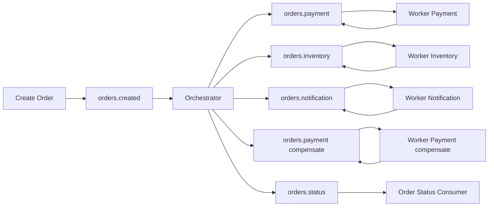
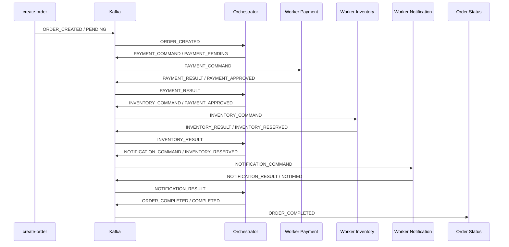

# Order Saga Microservices

Projeto de estudo em Go para simular o ciclo de vida de um pedido com saga orquestrada e workers assíncronos via Kafka.

O fluxo é centrado em um orquestrador que recebe a criação do pedido, publica comandos para os workers e decide o próximo passo a partir dos resultados de pagamento, estoque e notificação.

Este repositório foi desenhado para ser pequeno o suficiente para estudar rapidamente e rico o suficiente para demonstrar os principais pontos de uma arquitetura distribuída orientada a eventos: coordenação central da saga, separação de responsabilidades, retries, falhas definitivas, rastreabilidade ponta a ponta e depuração reproduzível.

## Resumo Rápido

Arquitetura implementada neste projeto:

- saga orquestrada com orquestrador central
- workers independentes para pagamento, estoque e notificação
- compensação assíncrona de pagamento quando o estoque falha após aprovação
- Kafka como barramento entre comandos, resultados e eventos finais
- persistência do estado da saga em PostgreSQL (recuperação pós-restart)
- journal de eventos com payloads de request/response dos gateways (rastreabilidade)
- banco de leitura (read model) alimentado por projeção via Kafka (serviço `projector`)
- execução local com Docker Compose
- debug ponta a ponta com VS Code e logs correlacionados

Leituras mais úteis neste README:

- [Quick Start](#quick-start)
- [Visão Geral da Arquitetura](#visão-geral-da-arquitetura)
- [Casos Possíveis na Aplicação](#casos-possíveis-na-aplicação)
- [Cenários Determinísticos para Debug](#cenários-determinísticos-para-debug)
- [Debug Ponta a Ponta no VS Code](#debug-ponta-a-ponta-no-vs-code)

## Destaques

- saga orquestrada com fluxo explícito de sucesso, retry e falha
- workers isolados por etapa: pagamento, estoque e notificação
- estorno de pagamento assíncrono com `transaction_id` para compensação
- Kafka como barramento de eventos entre os processos
- eventos terminais publicados separadamente para auditoria
- estado da saga persistido em PostgreSQL (banco de escrita) com recuperação após restart
- todos os eventos gravados em `saga_events` (journal) com payloads de request/response
- read model `order_views` no banco de leitura, projetado via Kafka pelo `projector`
- cenários determinísticos por `order_id` para reproduzir falhas e retries
- debug ponta a ponta com VS Code, Docker e logs correlacionados

## Quando Este Projeto é Útil

Este projeto é útil para quem quer:

- estudar saga orquestrada em Go sem depender de uma base muito grande
- entender como separar orquestração, domínio, infraestrutura e workers
- experimentar cenários de falha em pipelines assíncronos
- praticar debug distribuído com Kafka, logs e múltiplos processos
- usar um projeto base para evoluir depois com persistência, testes e observabilidade

## Objetivo

Este repositório demonstra:

- arquitetura de saga orquestrada em Go
- workers separados por responsabilidade
- integração assíncrona via Kafka
- fluxo completo de sucesso, retry e falha definitiva
- depuração ponta a ponta com VS Code, Docker e logs correlacionados

## Quick Start

```bash
make up
make create-order ORDER_ID=order-001
make logs
```

Para validar o projeto localmente:

```bash
make check
```

Para reproduzir cenários de debug:

```bash
make create-order ORDER_ID=order-payment-fail-001
make create-order ORDER_ID=order-inventory-retry-once-001
make create-order ORDER_ID=order-notification-fail-001

make create-order ORDER_ID=order-inventory-fail-001  # aciona compensação do pagamento quando aplicável
```

Para consultar a linha do tempo de um pedido no read model (banco de leitura):

```bash
make inspect ORDER_ID=order-001
```

Para consultar o journal completo de eventos com payloads (banco de escrita):

```bash
docker-compose exec postgres psql -U saga -d saga -c "SELECT id, component, direction, event_type, status_anterior, status_atual, payload, request_payload, response_payload FROM saga_events WHERE order_id='order-001' ORDER BY id;"
```

### Passo a passo

#### 1. Suba a stack local

```bash
make up
```

#### 2. Dispare um pedido de sucesso

```bash
make create-order ORDER_ID=order-001
```

#### 3. Dispare cenários controlados de debug

```bash
make create-order ORDER_ID=order-payment-fail-001
make create-order ORDER_ID=order-inventory-retry-once-001
make create-order ORDER_ID=order-notification-fail-001
```

#### 4. Acompanhe os logs

```bash
make logs
```

#### 5. Valide o projeto

```bash
make check
```

## Visão Geral da Arquitetura



## Fluxo Ponta a Ponta

### Fluxo Feliz



### Fluxo com falha no estoque (compensação)

```mermaid
sequenceDiagram
    participant C as create-order
    participant K as Kafka
    participant O as Orchestrator
    participant P as Worker Payment
    participant I as Worker Inventory
    participant PC as Worker Payment (compensate)
    participant S as Order Status

    C->>K: ORDER_CREATED / PENDING
    K->>O: ORDER_CREATED
    O->>K: PAYMENT_COMMAND / PAYMENT_PENDING
    K->>P: PAYMENT_COMMAND
    P->>K: PAYMENT_RESULT / PAYMENT_APPROVED (tx=transaction_id)
    K->>O: PAYMENT_RESULT
    O->>K: INVENTORY_COMMAND / PAYMENT_APPROVED
    K->>I: INVENTORY_COMMAND
    I->>K: INVENTORY_RESULT / FAILED
    K->>O: INVENTORY_RESULT
    O->>K: PAYMENT_COMPENSATE / (transaction_id)
    K->>PC: PAYMENT_COMPENSATE
    PC->>K: PAYMENT_COMPENSATE_RESULT / PAYMENT_REFUNDED
    K->>O: PAYMENT_COMPENSATE_RESULT
    O->>K: ORDER_FAILED / FAILED + payment_refunded=true
    K->>S: ORDER_FAILED
  ```

### Fluxo de Decisão da Saga

```mermaid
flowchart TD
    A[ORDER_CREATED] --> B[PAYMENT_COMMAND]
    B --> C{PAYMENT_RESULT}
    C -->|PAYMENT_APPROVED| D[INVENTORY_COMMAND]
    C -->|RETRYING| B
    C -->|FAILED| Z1[ORDER_FAILED]

    D --> E{INVENTORY_RESULT}
    E -->|INVENTORY_RESERVED| F[NOTIFICATION_COMMAND]
    E -->|RETRYING| D
    E -->|FAILED| H[PAYMENT_COMPENSATE]

    H --> I{PAYMENT_COMPENSATE_RESULT}
    I -->|PAYMENT_REFUNDED| Z3[ORDER_FAILED refund ok]
    I -->|RETRYING| H
    I -->|FAILED| Z4[ORDER_FAILED refund failed]

    F --> G{NOTIFICATION_RESULT}
    G -->|NOTIFIED| Z2[ORDER_COMPLETED]
    G -->|RETRYING| F
    G -->|FAILED| Z5[ORDER_COMPLETED notification error]
```

## Status do Pedido

- `PENDING`: pedido criado
- `PAYMENT_PENDING`: aguardando processamento de pagamento
- `PAYMENT_APPROVED`: pagamento aprovado
- `PAYMENT_REFUND_PENDING`: estorno em andamento antes do encerramento da saga
- `PAYMENT_REFUNDED`: pagamento estornado/compensado
- `INVENTORY_RESERVED`: estoque reservado
- `NOTIFIED`: notificação concluída
- `COMPLETED`: saga concluída com sucesso
- `RETRYING`: falha temporária com nova tentativa coordenada pelo orquestrador
- `FAILED`: falha definitiva ou limite de retry excedido

## Tipos de Evento

- `ORDER_CREATED`
- `PAYMENT_COMMAND`
- `PAYMENT_RESULT`
- `PAYMENT_COMPENSATE`
- `PAYMENT_COMPENSATE_RESULT`
- `INVENTORY_COMMAND`
- `INVENTORY_RESULT`
- `NOTIFICATION_COMMAND`
- `NOTIFICATION_RESULT`
- `ORDER_COMPLETED`
- `ORDER_FAILED`

## Tópicos Kafka

- `orders.created`: evento inicial do pedido
- `orders.payment`: comandos e resultados de pagamento
- `orders.inventory`: comandos e resultados de estoque
- `orders.notification`: comandos e resultados de notificação
- `orders.status`: eventos terminais da saga

Todos os eventos usam `order_id` como chave de particionamento para preservar a ordem lógica do pedido.

## Estrutura do Projeto

```text
cmd/
  create-order/           publica o evento inicial do pedido
  orchestrator/           coordena a saga
  order-status/           consome eventos finais para auditoria
  worker-inventory/       processa estoque
  worker-notification/    processa notificação
  worker-payment/         processa pagamento

internal/
  application/            casos de uso e orquestração
  domain/                 entidades, eventos e status
  infrastructure/
    external/             simuladores das APIs externas
    kafka/                producer, consumer, tópicos e configuração
  interfaces/             adapters e logging

.vscode/                  debug ponta a ponta no VS Code
docker-compose.yml        stack local com Kafka
Dockerfile                build parametrizado dos binários Go
Makefile                  atalhos de execução e validação
```

## Tecnologias Utilizadas

- Go 1.26.6
- Kafka
- `github.com/segmentio/kafka-go`
- Docker
- Docker Compose
- VS Code Debug
- `gofmt`
- `go vet`
- `golangci-lint`

## Requisitos

- Go 1.26.6
- Docker
- Docker Compose
- VS Code com extensão Go, se quiser usar o fluxo de debug composto

## Como Executar Localmente

### Via Makefile

`make up` sobe a stack em background e devolve o terminal. Para acompanhar a execução, use `make logs`.

```bash
make up
```

### Criar um pedido manualmente

```bash
make create-order ORDER_ID=order-001
```

### Ver logs

```bash
make logs
```

### Derrubar a stack

```bash
make down
```

### Validar o projeto

```bash
make check
```

### Principais atalhos disponíveis

```bash
make help
make up
make logs
make create-order ORDER_ID=order-001
make check
make down
```

## Debug Ponta a Ponta no VS Code

O workspace já contém configuração para depurar a saga inteira localmente.

### Sessões disponíveis

- `Debug Saga End-to-End`
- `Debug Orchestrator`
- `Debug Worker Payment`
- `Debug Worker Inventory`
- `Debug Worker Notification`
- `Debug Order Status`
- `Create Order Event`

### Como usar

1. Inicie `Debug Saga End-to-End`.
2. O VS Code sobe `kafka` e `kafka-init` antes de iniciar os processos Go.
3. Rode `Create Order Event` e informe um `order_id`.
4. Acompanhe breakpoints e logs correlacionados nos processos locais.

Nesse modo, o Kafka roda em container e os processos Go rodam localmente com `KAFKA_BROKERS=localhost:9094`.

## Logs e Correlação

O projeto foi instrumentado para permitir rastreamento ponta a ponta.

### Logs de consumo

Os consumers registram:

- `component`
- `phase`
- `event_id`
- `order_id`
- `saga_id`
- `transaction_id`
- `type`
- `status_previous`
- `status_current`
- `schema_version`
- `metadata`
- `duration`

### Logs de publicação

O producer registra:

- `phase=publishing`
- `phase=published`
- `phase=failed`
- `topic`
- `payload_bytes`
- `transaction_id` quando presente
- todos os campos de correlação do evento

### Logs de decisão do orquestrador

O orquestrador registra ações como:

- `action=start`
- `action=handle-created`
- `action=dispatch-next`
- `action=advance`
- `action=retry-requested`
- `action=retrying`
- `action=retry-limit-exceeded`
- `action=fail-requested`
- `action=failed`
- `action=publishing-completed`
- `action=completed`

## Casos Possíveis na Aplicação

| Caso | O que acontece | Resultado final |
| --- | --- | --- |
| Sucesso completo | pagamento, estoque e notificação concluem com sucesso | `ORDER_COMPLETED` / `COMPLETED` |
| Falha definitiva no pagamento | pagamento retorna `FAILED` | `ORDER_FAILED` / `FAILED` |
| Falha definitiva no estoque (após pagamento aprovado) | estoque retorna `FAILED`; orquestrador solicita `PAYMENT_COMPENSATE` assíncrono com `transaction_id` e só finaliza após `PAYMENT_COMPENSATE_RESULT` | `ORDER_FAILED` / `FAILED` com metadata de estorno |
| Falha definitiva na notificação | notificação retorna `FAILED` (não houve erro em etapas anteriores) | `ORDER_COMPLETED` / `COMPLETED` + metadata `notification_error=true` |
| Falha temporária com recuperação | uma etapa retorna `RETRYING` e depois conclui | saga continua até sucesso ou nova decisão |
| Falha temporária até estourar retry em pagamento ou estoque | a etapa continua falhando temporariamente | `ORDER_FAILED` / `FAILED` |
| Falha temporária até estourar retry em notificação | a notificação continua falhando temporariamente | `ORDER_COMPLETED` / `COMPLETED` + metadata `notification_error=true` |
| Evento fora de ordem | resultado chega incompatível com o estado atual | evento rejeitado e saga não avança |

> Observação: quando aplicável, o orquestrador solicita um estorno assíncrono (`PAYMENT_COMPENSATE`) usando o `transaction_id` retornado no `PAYMENT_RESULT`. A saga só é encerrada depois do `PAYMENT_COMPENSATE_RESULT`, permitindo que o evento terminal carregue o resultado do estorno para auditoria e comunicação ao usuário.

### 1. Pedido completado com sucesso

Condição:

- pagamento aprovado
- estoque reservado
- notificação enviada

Resultado final:

- evento terminal `ORDER_COMPLETED`
- status final `COMPLETED`

### 2. Falha definitiva no pagamento

Condição:

- o worker de pagamento retorna `FAILED`

Resultado final:

- saga encerrada imediatamente
- evento terminal `ORDER_FAILED`
- status final `FAILED`

### 3. Falha definitiva no estoque

Condição:

- pagamento aprovado
- estoque retorna `FAILED`

Resultado final:

- saga encerrada com falha para o pedido
- evento terminal `ORDER_FAILED` emitido apenas após o resultado do estorno
- status final `FAILED`
- comando assíncrono `PAYMENT_COMPENSATE` publicado com `transaction_id`
- estorno processado pelo `worker-payment` antes do encerramento
- metadata terminal indicando `payment_refunded=true` ou `payment_refund_failed=true`

### 4. Falha definitiva na notificação

Condição:

- pagamento aprovado
- estoque reservado
- notificação retorna `FAILED`

Resultado final:

- pedido concluído mesmo com falha de notificação
- evento terminal `ORDER_COMPLETED`
- status final `COMPLETED`
- metadata `notification_error=true`

### 5. Falha temporária com recuperação

Condição:

- qualquer etapa retorna `RETRYING`
- nova tentativa subsequente conclui com sucesso

Resultado final:

- saga continua a partir da mesma etapa
- fluxo pode terminar em `COMPLETED`

### 6. Falha temporária até exceder o limite de retry

Condição:

- a mesma etapa continua retornando falha temporária
- o limite do orquestrador é excedido

Resultado final:

- em pagamento ou estoque: saga encerrada com `FAILED`
- em notificação: pedido concluído com `ORDER_COMPLETED`
- metadata indicando `retry_limit_exceeded`
- em retry esgotado de estorno: metadata também indica `payment_refund_failed=true`

### 7. Evento fora de ordem

Condição:

- o orquestrador recebe um resultado incompatível com o estado atual da saga

Resultado final:

- evento rejeitado
- erro de fluxo registrado em log
- saga não avança sem validação correta

## Cenários Determinísticos para Debug

Os simuladores externos aceitam padrões no `order_id` para reproduzir cenários específicos.

### Pagamento

- `payment-fail`: falha definitiva
- `payment-retry`: falha temporária em todas as tentativas
- `payment-retry-once`: falha temporária na primeira tentativa e sucesso na seguinte

### Estoque

- `inventory-fail`: falha definitiva
- `inventory-retry`: falha temporária em todas as tentativas
- `inventory-retry-once`: falha temporária na primeira tentativa e sucesso na seguinte

### Notificação

- `notification-fail`: falha definitiva
- `notification-retry`: falha temporária em todas as tentativas
- `notification-retry-once`: falha temporária na primeira tentativa e sucesso na seguinte

### Exemplos

```bash
make create-order ORDER_ID=order-payment-fail-001
make create-order ORDER_ID=order-inventory-retry-once-001
make create-order ORDER_ID=order-notification-fail-001
make create-order ORDER_ID=order-payment-retry-001
```

## Contrato da Mensagem

Cada evento carrega, no mínimo:

- `event_id`
- `order_id`
- `saga_id`
- `status_atual`
- `status_anterior`
- `event_type`
- `schema_version`
- `created_at`
- `metadata`

Serialização atual:

- JSON

## Decisões Importantes de Arquitetura

- saga orquestrada, não coreografada
- Kafka isolado em infraestrutura
- workers independentes por etapa
- estado do orquestrador persistido em PostgreSQL (banco de escrita)
- journal de eventos (`saga_events`) para rastreabilidade com payloads de request/response
- banco de leitura com read model (`order_views`) alimentado por projeção via Kafka (CQRS)
- garantia at-least-once + dedup por `event_id`; Outbox Pattern previsto para a Fase 3
- tópicos separados por etapa
- eventos terminais enviados para `orders.status`
- debug orientado por correlação de logs e cenários dirigidos por `order_id`

## Escopo Atual

Incluído nesta fase:

- arquitetura central da saga
- contratos de evento
- workers assíncronos
- simuladores externos
- persistência do estado da saga e journal de eventos (PostgreSQL)
- read model no banco de leitura com serviço `projector`
- migrations com `golang-migrate` via Docker
- Docker para execução local
- debug ponta a ponta no VS Code

## O Que Este Projeto Ainda Não Faz

- Outbox Pattern, DLQ e idempotência completa (Fase 3)
- API REST de consulta de pedido (o read model `order_views` já está pronto para isso)
- observabilidade formal com tracing e métricas
- tratamento de produção com políticas avançadas de retry

Fora de escopo nesta fase:

- Outbox Pattern / DLQ / idempotência persistida
- API REST
- observabilidade formal
- integração automatizada (testcontainers)
- concorrência explícita com goroutines

## Próximos Passos Naturais

- Fase 3: Outbox Pattern, DLQ e idempotência completa por `event_id`
- API REST de consulta de pedido lendo o read model `order_views`
- testes de integração com testcontainers (Kafka + Postgres reais)
- introduzir observabilidade estruturada
- comparar versão sequencial com versão concorrente
- evoluir o contrato de mensagens conforme novos cenários# workers-kafka
